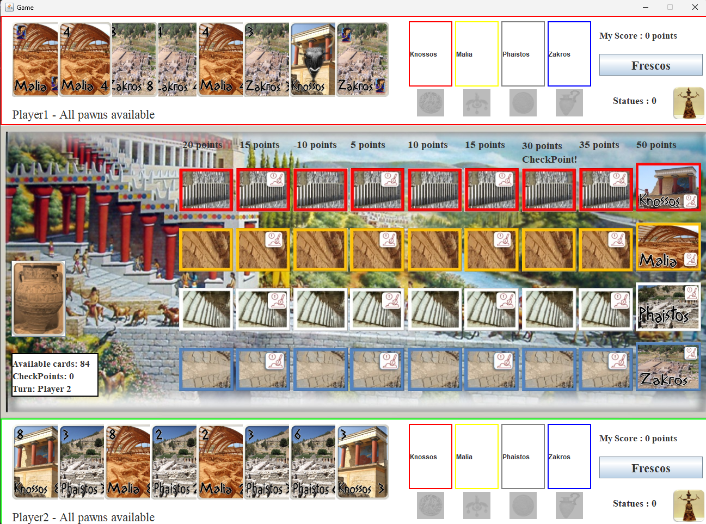

# Lost Relics card game

This repo contains the implementation of a card game I made in my second year as a CS bachelor. You can find the architecture of the implementation in [here](Reportv2.pdf). Find the (badly) translated game rules [here](HY252-Project_Xamena_Anaktora(english).pdf) or if you speak greek [here](HY252-Project_Xamena_Anaktora(here).pdf).

## Game view

## Usage
Import the project to eclipse or your prefered Java IDE, and run.